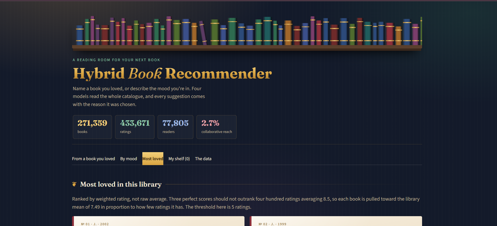
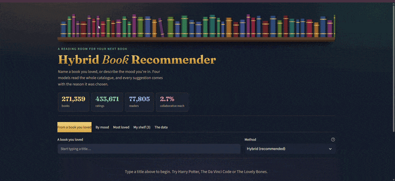
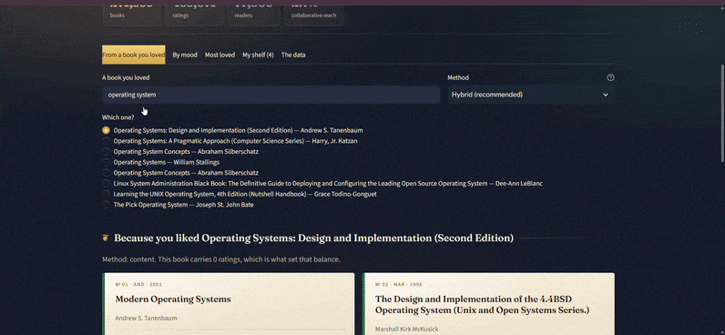

# Hybrid Books Recommender System

A book recommender that combines content-based filtering and collaborative filtering, and decides how much to trust each one based on how much rating data a book actually has. Built with scikit-learn and Streamlit on the Book-Crossing dataset of 271,359 books.


**Live demo:** [hybrid-books-recommender-system-abypdeffa6mibqdrsrqms4.streamlit.app](https://hybrid-books-recommender-system-abypdeffa6mibqdrsrqms4.streamlit.app/)



## What this project does

You tell it a book you loved, or describe the kind of book you are in the mood for, and it recommends books from a catalogue of 271,359 titles. Every recommendation comes with the reason it was chosen and a tag showing which model produced it.

The interesting part is the problem it solves. Most book recommenders use collaborative filtering alone ("readers who liked X also liked Y"). That only works for books with plenty of ratings. In the Book-Crossing data most books have been rated by very few readers, so a collaborative model cannot see them at all. This is known as the cold start problem. On this dataset the effect is dramatic: collaborative filtering can recommend only **2.7%** of the catalogue. The other 97.3% is invisible to it.

This project handles it with a hybrid. Books with little rating data are recommended by what they are about. Books with lots of rating data lean on what readers actually liked. The balance shifts gradually between the two.

## Features

- **Recommend from a book you loved.** Search any title and compare three methods: hybrid, content only and collaborative only.
- **Mood search.** Describe what you want in plain words and it searches the catalogue text.
- **Most loved.** Books ranked by weighted rating, so three perfect scores cannot outrank four hundred good ones.
- **Surprise me.** A random pick from the best rated books.
- **My shelf.** Save books during a session and download the list as CSV.
- **The data.** Dataset statistics, rating distributions and collaborative reach, the share of the catalogue that collaborative filtering can recommend.
- **Explained results.** Each card shows why the book was recommended and which model chose it.

## Demo

**Recommending from a book you loved**



**Mood search, most loved and surprise me**



## How it works

Four models are built when the app starts.

**1. Content-based filtering**
Each book becomes a TF-IDF vector built from its title, author, genre and description, with title and author weighted more heavily. Similar books are found with cosine similarity. This works for every book, including ones nobody has rated.

**2. Collaborative filtering**
Ratings are stored in a sparse book by user matrix. Books with fewer than 8 ratings and users with fewer than 3 are removed first, since they add noise rather than signal. Similar books are found with item to item cosine similarity.

**3. Hybrid**
The two scores are blended with a weight based on how many ratings the source book has:

```
cf_weight      = min(rating_count / 60, 0.75)
content_weight = 1 - cf_weight
```

A book with 600 ratings leans on collaborative filtering. A book with 4 ratings falls back to content-based filtering completely. This is how cold start is handled.

**4. Weighted rating**
Used for the Most loved list, based on the IMDB formula:

```
WR = (v / (v + m)) * R + (m / (v + m)) * C
```

`v` is the number of ratings, `R` the book's average rating, `C` the average across all books, and `m` the 90th percentile of rating counts. Books with few ratings are pulled toward the overall average.

## Dataset

This project uses the **Book-Crossing dataset**, collected by Cai-Nicolas Ziegler in 2004 from the Book-Crossing reading community.

**Download:** [Book Recommendation Dataset on Kaggle](https://www.kaggle.com/datasets/arashnic/book-recommendation-dataset)

The download contains three files, of which two are used:

| File | Contents | Size |
|---|---|---|
| `Books.csv` | ISBN, title, author, year of publication, publisher, cover image links | about 271,000 books |
| `Ratings.csv` | User ID, ISBN, rating from 0 to 10 | about 1.15 million ratings |
| `Users.csv` | User location and age | not used |

**Cleaning applied**

- A rating of 0 means a user interacted with a book without scoring it. These are not opinions, so they are removed, leaving 433,671 explicit ratings from 77,805 readers.
- Books and ratings are joined on ISBN.
- Invalid years such as 0 are hidden, and malformed rows are skipped.
- Column names are detected automatically, so other book datasets with similar columns also work.

The dataset files are not included in this repository because of their size. Without them the app runs on a small built-in sample library, so it can still be tried.

## Getting started

**1. Clone and install**

```
git clone https://github.com/mahnoorishfaq/Hybrid-Books-Recommender-System.git
cd Hybrid-Books-Recommender-System
python -m venv venv
venv\Scripts\activate
pip install -r requirements.txt
```

On Mac or Linux, activate with `source venv/bin/activate`.

**2. Add the dataset**

Download and unzip the dataset from Kaggle, then run:

```
python setup_data.py
```

A file picker opens. Choose `Books.csv`, then `Ratings.csv`. The files are checked and copied into the `data/` folder.

**3. Run the app**

```
streamlit run app.py
```

The first start takes a minute or two while the models are built on the full dataset. After that they are cached.

## Project structure

```
Hybrid-Books-Recommender-System/
├── assets/
│   ├── home.png
│   ├── recommend.gif
│   └── mood-search.gif
├── app.py               Streamlit interface
├── recommender.py       content, collaborative, hybrid and weighted rating models
├── data_loader.py       CSV reading, cleaning and column detection
├── setup_data.py        file picker that loads the dataset into data/
├── test_render.py       tests for card rendering and edge cases
├── requirements.txt
├── .streamlit/
│   └── config.toml      theme settings
└── data/
    ├── sample_books.csv     small sample library
    └── sample_ratings.csv   synthetic ratings for the sample
```

## Tech stack

Python, pandas, NumPy, SciPy (sparse matrices), scikit-learn (TF-IDF, cosine similarity), Streamlit, custom HTML and CSS.

## Limitations

- Book-Crossing has no descriptions or genres, so content similarity relies on titles and authors, and summaries are not shown.
- TF-IDF matches words, not meaning. Two books on the same theme described with different words will not look similar.
- Collaborative filtering only reaches books with enough ratings, which is only 2.7% of this catalogue. The hybrid exists because of this.
- There is no offline evaluation yet, so the three models are not compared with metrics such as hit rate.
- The sample library's ratings are synthetic and exist only so the app runs without the full dataset.

## Future work

- Offline evaluation: hold out a share of ratings and compare hit rate at 10 across content, collaborative and hybrid.
- Sentence embeddings instead of TF-IDF, so similarity is based on meaning.
- Add descriptions and genres from the Google Books API.
- Show cover images using the dataset's image links.

## Acknowledgements

Book-Crossing dataset: Cai-Nicolas Ziegler, Sean M. McNee, Joseph A. Konstan and Georg Lausen. *Improving Recommendation Lists Through Topic Diversification.* Proceedings of the 14th International World Wide Web Conference (WWW '05), Chiba, Japan, 2005.

## Author

**Mahnoor Ishfaq**, BS Artificial Intelligence
GitHub: [mahnoorishfaq](https://github.com/mahnoorishfaq)
